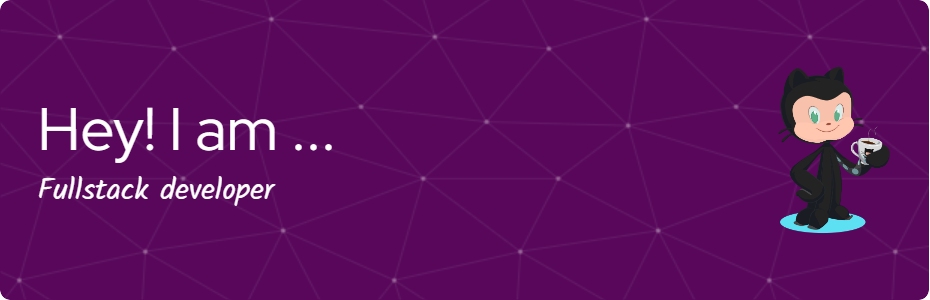

<h1 align="center">Hi 👋, I'm Rachita Bhasin</h1>
<h3 align="center">A passionate Fullstack developer from India</h3>
<picture> </picture>

 
 

 
- 📫 How to reach me **rachitabhasin99@gmail.com**

- 📄 Know about my experiences [https://drive.google.com/file/d/1Bm-NA6mNE_yOqwrOXFpRUHmhNUp4mREs/view](https://drive.google.com/file/d/1Bm-NA6mNE_yOqwrOXFpRUHmhNUp4mREs/view)

- ⚡Fact about me **Friendly Nature**

<h3 align="left">Connect with me:</h3>

<h3 align="left">Languages and Tools:</h3>

                              

<!--

&nbsp;

-->
